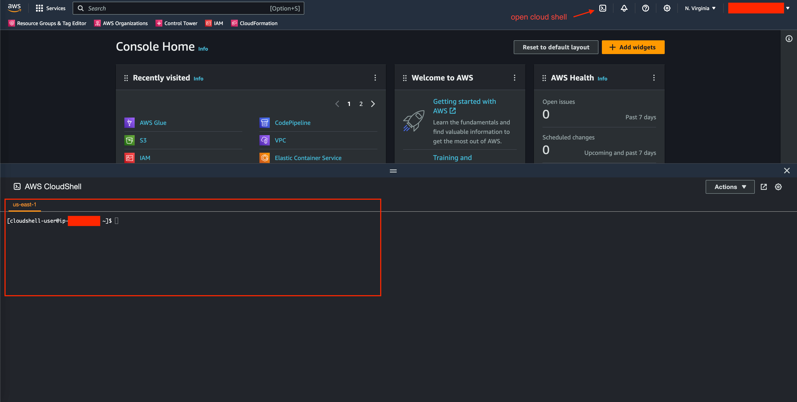

User Guide - Quick Start
==============================================================================
If you are a first-time user, this document will guide you through the basic usage of this app.

💾 Installation
------------------------------------------------------------------------------
``aws_resource_search`` requires ``Python3.8+``. To install, just run:

.. code-block:: bash

    pip install aws-resource-search

To show the help message, run:

.. code-block:: bash

    ars -h

To verify the installation, run:

.. code-block:: bash

    ars -v

If you just want to quickly explore the feature, you can use `AWS Cloud Shell <https://aws.amazon.com/cloudshell/>`_, an AWS managed shell environment without need setting the AWS CLI credentials. You can enter the cloud shell by clicking the icon on the top right corner of the AWS Console.

Then you can just do:

.. code-block:: bash

    # this install aws-resource-search in to global python
    pip3 install aws-resource-search
    ars -h

    # or you can install aws-resource-search in virtualenv
    pip3 install virtualenv
    virtualenv .venv
    source .venv/bin/activate
    pip install aws-resource-search
    ars -h

Congrats, you are all set! You can jump to :ref:`search-aws-resource` section to continue.

🔑 Setup Your AWS CLI
------------------------------------------------------------------------------
``aws_resource_search`` utilizes the ``default`` AWS CLI credential on your local machine to authenticate with AWS. You can refer the `Official Configure the AWS CLI <https://docs.aws.amazon.com/cli/latest/userguide/cli-chap-configure.html>`_ document to set up your AWS CLI.

If you want to search across multiple AWS accounts and regions, you can create multiple AWS CLI profiles and switch between them. For detailed instructions on setting up multiple AWS profiles, please refer the `Official Configuration and credential file settings <https://docs.aws.amazon.com/cli/latest/userguide/cli-configure-files.html>`_ document.

In summary, the configuration and credential file should looks like below.

Content of ``${HOME}/.aws/config``:

.. code-block:: cfg

    [default]
    region = us-east-1
    output = json

    # setup for IAM user based authentication
    [profile account_name_1_region_1_iam_user_1]
    region = us-east-1 # <--- don't forget region
    output = json

    [profile account_name_1_region_2_iam_user_1]
    region = us-west-1
    output = json

    [profile account_name_2_region_1_iam_user_2]
    region = us-east-1
    output = json

    [profile account_name_2_region_2_iam_user_2]
    region = us-west-1
    output = json

    # setup for IAM assumed role based authentication
    [profile account_name_3_region_1_role_1]
    region = us-east-1 # <--- don't forget region
    output = json
    role_arn = arn:aws:iam::111122223333:role/my-role-name
    source_profile = account_name_1_region_1_iam_user_1

    # setup for Single Sign On (SSO) based authentication
    [profile account_name_4_region_1_role_1]
    sso_start_url = https://mycompany.awsapps.com/start#/
    sso_region = us-east-1 # <--- don't forget region
    sso_account_id = 123456789012
    sso_role_name = MySSORole
    region = us-east-1
    output = json

Content of ``${HOME}/.aws/credentials``:

.. code-block:: cfg

    [default]
    aws_access_key_id = A1B2C3D4ACCESSKEYEXAMPLE
    aws_secret_access_key = A1B2C3D4SECRETKEYEXAMPLE

    [account_name_1_region_1_iam_user_1]
    aws_access_key_id = A1B2C3D4ACCESSKEYEXAMPLE
    aws_secret_access_key = A1B2C3D4SECRETKEYEXAMPLE

    [account_name_1_region_2_iam_user_1]
    aws_access_key_id = A1B2C3D4ACCESSKEYEXAMPLE
    aws_secret_access_key = A1B2C3D4SECRETKEYEXAMPLE

    [account_name_2_region_1_iam_user_1]
    aws_access_key_id = A1B2C3D4ACCESSKEYEXAMPLE
    aws_secret_access_key = A1B2C3D4SECRETKEYEXAMPLE

    [account_name_2_region_2_iam_user_1]
    aws_access_key_id = A1B2C3D4ACCESSKEYEXAMPLE
    aws_secret_access_key = A1B2C3D4SECRETKEYEXAMPLE

    # it uses assume role, so no need to put any credential here
    # but you should still put an empty section here to match the .aws/config file
    [account_name_3_region_1_role_1]

    # it uses SSO, so no need to put any credential here
    # but you should still put an empty section here to match the .aws/config file
    [account_name_4_region_1_role_1]

.. admonition:: Golden Rules to manage your .aws files
   :class: note

    1. all named profile should be declared in ``.aws/config`` file.
    2. the profile in ``.aws/config`` and ``.aws/credentials`` should match, even a profile doesn't need credential, you should still create an empty section in ``.aws/credentials`` file.
    3. don't forget to explicitly set AWS region in ``.aws/config`` using ``region = ${your_region}``.
    4. follow the above example to setup assumed role profile and single-sign-on profile.
    5. if there's an boto3 error, read this golden rules again.

🔑 Switch Between AWS Profile
------------------------------------------------------------------------------
You can use the ``ars set-profile`` command to enter an interactive session to set the default profile.

.. code-block:: bash

    ars set-profile

Then you will see four options. Mostly you only need the first one ``Set an named profile as default``.

.. code-block::

    (Query):
    [x] 📝 Set an named profile as default
          Hit 'Tab' to search profile
    [ ] 🔐 Do CLI MFA Authentication
          Hit 'Tab' to select a base profile
    [ ] 🌐 Sign in to AWS Console
          Hit 'Tab' to select a profile to sign in
    [ ] 🔄 Switch Role in to AWS Console
          Hit 'Tab' to select a profile to switch to

Then you can type query to select the profile you want to set as default, then hit "Enter".

.. code-block::

    (Query): set_profile_as_default
    [x] 📝 my_company_dev | us-east-1
          Hit 'Enter' to set 'my_company_dev' as the default profile.
    [ ] 📝 my_company_test | eu-west-1
          Hit 'Enter' to set 'my_company_test' as the default profile.
    [ ] 📝 my_company_prod | eu-west-1
          Hit 'Enter' to set 'my_company_prod' as the default profile.

.. note::

    You can use the ``ars which`` command to check the current AWS account you are searching to

    .. code-block:: bash

        $ ars which
        AWS Account ID = 123456789012
        AWS Account Alias = my_company_aws_account
        AWS Region = us-east-1

This feature is based on my another project ``awscli_mate``. Please refer the `Use awscli_mate as a Interactive CLI <https://github.com/MacHu-GWU/awscli_mate-project#use-awscli_mate-as-a-interactive-cli>`_ to learn more.

.. _search-aws-resource:

🔍 Search AWS Resource
------------------------------------------------------------------------------
You can use the ``ars`` (AWS Resource Search) command to enter the main interactive session to search AWS Resources.

.. image:: https://asciinema.org/a/618423.svg
    :target: https://asciinema.org/a/618423

**Select Resource Type**

The landing page shows a :ref:`list of implemented AWS resource types <user-guide-implemented-aws-resource-types>`. You can use your keyboard to select or filter the resource type and then tap ``Tab`` or ``Enter`` to start searching. Please refer the :ref:`user-guide-keyboard-shortcut` for full list of keyboard shortcuts.

.. code-block::

    (Query):
    [x] cloudformation-stack
          hit Tab and enter your query to search cloudformation-stack.
    [ ] codecommit-repository
          hit Tab and enter your query to search codecommit-repository.
    [ ] dynamodb-table
          hit Tab and enter your query to search dynamodb-table.
    [ ] ec2-instance
          hit Tab and enter your query to search ec2-instance.
    [ ] ec2-securitygroup
          hit Tab and enter your query to search ec2-securitygroup.

**Refresh Implemented Resource Type**

If you have recently installed a new version of ``aws_resource_search``, you need to refresh it in order to obtain the most up-to-date list of implemented resource types. You can simply type ``!~`` to refresh the list.

.. code-block::

    (Query): !~

**Select AWS Resources**

After you have selected the resource type, you will see a list of AWS resources. For the first time use, it may takes a few seconds to pull the data and create the index.

.. code-block::

    (Query): s3-bucket:
    [x] Pulling data for 's3-bucket', it may takes 1-60 seconds ...
          please wait, don't press any key

Then you can enter your query to search the AWS resources.

.. code-block::

    (Query): s3-bucket: infra
    [x] bucket_name = i-1-sbx-a1b2c3-infrastructure-s3-bucket
          create_at = 2023-11-01T17:25:40+00:00, 🌐 Enter, 📋 Ctrl A, 🔗 Ctrl U, 👀 Ctrl P.
    [ ] bucket_name = i-6-sbx-a1b2c3-infrastructure-s3-bucket
          create_at = 2023-11-01T17:25:40+00:00, 🌐 Enter, 📋 Ctrl A, 🔗 Ctrl U, 👀 Ctrl P.
    [ ] bucket_name = i-15-tst-a1b2c3-infrastructure-s3-bucket
          create_at = 2023-11-01T17:25:40+00:00, 🌐 Enter, 📋 Ctrl A, 🔗 Ctrl U, 👀 Ctrl P.
    [ ] bucket_name = i-16-sbx-a1b2c3-infrastructure-s3-bucket
          create_at = 2023-11-01T17:25:40+00:00, 🌐 Enter, 📋 Ctrl A, 🔗 Ctrl U, 👀 Ctrl P.
    [ ] bucket_name = i-22-prd-a1b2c3-infrastructure-s3-bucket
          create_at = 2023-11-01T17:25:40+00:00, 🌐 Enter, 📋 Ctrl A, 🔗 Ctrl U, 👀 Ctrl P.

You may notice ``🌐 Enter, 📋 Ctrl A, 🔗 Ctrl U, 👀 Ctrl P.``. These are **user action** that you can interact with the selected AWS resources. ``aws_resource_search`` has the following built-in user actions:

- 🌐: tap ``Enter`` to open AWS console url of this resource in web browser.
- 📋: tap ``Ctrl + A`` to copy ARN (AWS Resource Name) to clipboard.
- 🔗: tap ``Ctrl + U`` to copy AWS console url to clipboard (So you can paste it later).
- 👀: tap ``Ctrl + P`` to view more details about this resource, including details, tags, policies, etc ...
- ⤴️: tap ``F1`` to quit the the "viewing details" sub session.
- ◀️: tap ``Ctrl + B`` to clear the query of the current AWS resource type, so you can enter another query.
- ↩️: tap ``Ctrl + X`` to clear the query input to start over.

Please refer the :ref:`user-guide-keyboard-shortcut` for full list of keyboard shortcuts.

**👀 View AWS Resource Details**

You can tap ``Ctrl + P`` to view detailed information about the selected bucket. You can also tap ``Ctrl + A`` to copy the value of the detail. This is particularly useful when you need to copy a JSON object.

.. code-block::

    (Query): Detail of bucket_name = i-1-sbx-a1b2c3-infrastructure-s3-bucket, press F1 to go back.
    [x] s3 uri = s3://i-1-sbx-a1b2c3-infrastructure-s3-bucket
          🌐 Enter to open url, 📋 Ctrl A to copy.
    [ ] s3 arn = arn:aws:s3:::i-1-sbx-a1b2c3-infrastructure-s3-bucket
          🌐 Enter to open url, 📋 Ctrl A to copy.
    [ ] location = us-east-1
          📋 Ctrl A to copy.
    [ ] bucket_policy = {"Version": "2012-10-17", "Id": "PutObjPolicy", "Statement": [{"Sid": "DenyO...XAMPLE-BUCKET/*", "Condition": {"Null": {"s3:x-amz-server-side-encryption-aws-kms-key-id": "true"}}}]}
          📋 Ctrl A to copy.
    [ ] 🏷 tag: Environment = sbx
          📋 Ctrl A to copy key and value.

At the end, you can press ``F1`` to return to the previous view and select another S3 bucket.

**🔁 Refresh Data**

``aws_resource_search`` uses cache to speed up the search. The dataset will be automatcially refreshed every 24 hours. If your query doesn't return any result, you can type ``!~`` to refresh the data.

.. code-block::

    (Query): s3-bucket: my-fresh-bucket!~
    [x] Pulling data for 's3-bucket', it may takes 1-60 seconds ...
          please wait, don't press any key

.. note::

    The AWS resource data cache is partitioned by AWS account, region, and resource type. The ``!~`` command will only refresh the given partition. If you want to refresh all the data in all aws accounts, you can run the following command in your teminal:

    .. code-block:: bash
    
        $ ars clear
        clear index in /Users/username/.aws_resource_search/.index
        clear cache in /Users/username/.aws_resource_search/.cache
        done, you can verify at file:///Users/username/.aws_resource_search

🔍 Search Child Resource
------------------------------------------------------------------------------
Sometimes, you may need to specify a parent AWS resource to search for its child resources. For instance, when searching for a AWS glue table, you must specify the AWS Glue database, or when searching for StepFuction executions, you need to specify an AWS StepFunction state machine.

.. image:: https://asciinema.org/a/618428.svg
    :target: https://asciinema.org/a/618428

In this example, you can select the ``sfn-execution`` resource type, which will display a list of state machines. From there, you can choose or filter the desired state machine and press the ``Tab`` key to initiate the execution search.

.. code-block::

    (Query): sfn-execution:
    [ ] sfn-statemachine: name = i-1-prd-a1b2c3-infrastructure-sfn-state-machine
          Tap Tab to search sfn-execution in this sfn-statemachine, Tap Enter to open sfn-statemachine url.
    [ ] sfn-statemachine: name = i-2-sbx-a1b2c3-infrastructure-sfn-state-machine
          Tap Tab to search sfn-execution in this sfn-statemachine, Tap Enter to open sfn-statemachine url.
    [x] sfn-statemachine: name = i-3-tst-a1b2c3-infrastructure-sfn-state-machine
          Tap Tab to search sfn-execution in this sfn-statemachine, Tap Enter to open sfn-statemachine url.
    [ ] sfn-statemachine: name = i-4-sbx-a1b2c3-businessreport-sfn-state-machine
          Tap Tab to search sfn-execution in this sfn-statemachine, Tap Enter to open sfn-statemachine url.
    [ ] sfn-statemachine: name = i-5-prd-a1b2c3-infrastructure-sfn-state-machine
          Tap Tab to search sfn-execution in this sfn-statemachine, Tap Enter to open sfn-statemachine url.

When querying child resources, the query syntax is ``${resource_type}: ${parent_resource_identifier}@${child_resource_query}``. After pressing ``Tab``, you will see a list of child resources that you can select or further refine."

.. code-block::

    (Query): sfn-execution: i-3-tst-a1b2c3-infrastructure-sfn-state-machine@
    [x] sfn-execution: execution_name = a86232aa-87da-4929-954f-4f61ba7adaba
          🔵 RUNNING, start = 2023-11-01 16:59:57, end = NA, 🌐 Enter, 📋 Ctrl A, 🔗 Ctrl U, 👀 Ctrl P.
    [ ] sfn-execution: execution_name = 419c4442-c959-49f8-a4eb-3c5060ca5a59
          🔵 RUNNING, start = 2023-11-01 16:59:57, end = NA, 🌐 Enter, 📋 Ctrl A, 🔗 Ctrl U, 👀 Ctrl P.

🔑 Switch Between AWS Profile - The Fast Way
------------------------------------------------------------------------------
You can type ``!@`` anytime when searching, it bring you to the AWS profile selection menu. And you can hit enter to instantly switch to another AWS profile and continue searching. You never need to leave the interactive search session.

.. code-block::

    (Query): s3-bucket: your query here but you want to switch!@another profile
    [x] 📝 profile = my_company_dev | region = us-east-1
          Hit 'Enter' to set 'my_company_dev' as the default profile.
    [ ] 📝 profile = my_company_test | region = eu-west-1
          Hit 'Enter' to set 'my_company_test' as the default profile.
    [ ] 📝 profile = my_company_prod | region = eu-west-1
          Hit 'Enter' to set 'my_company_prod' as the default profile.

🔍 Show AWS Info of Current AWS Profile
------------------------------------------------------------------------------
If you are not sure which AWS account and region you are currently using, you can type ``!?`` anytime when searching. It will show you the current AWS account info. Then you can tap ``Tab`` or ``Enter`` to go back searching, or tap ``Ctrl W`` to enter the AWS profile switching menu.

.. code-block::

    (Query): s3-bucket: !?
    [x] 📝 See AWS Account Info of current boto session below
          Hit Tab or Enter to go back, Hit Ctrl W to pick another AWS profile
    [ ] Current aws_account_alias = your-aws-account-alias
          Hit Tab or Enter to go back, Hit Ctrl W to pick another AWS profile
    [ ] Current aws_account_id = 123456789010
          Hit Tab or Enter to go back, Hit Ctrl W to pick another AWS profile
    [ ] Current aws_region = us-east-1
          Hit Tab or Enter to go back, Hit Ctrl W to pick another AWS profile
